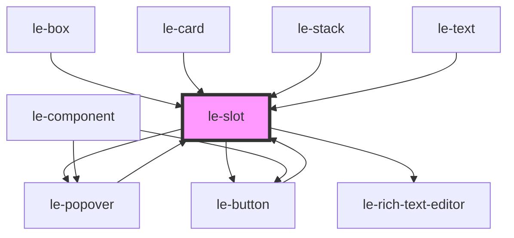

# le-slot

<!-- Auto Generated Below -->

## Overview

Slot placeholder component for admin/CMS mode.

This component renders a visual placeholder for slots when in admin mode,
allowing CMS systems to show available drop zones for content or inline editing.

In non-admin mode, this component renders nothing and acts as a passthrough.

## Properties

| Property            | Attribute            | Description                                                                                                                                                                                                                                | Type                                            | Default      |
| ------------------- | -------------------- | ------------------------------------------------------------------------------------------------------------------------------------------------------------------------------------------------------------------------------------------ | ----------------------------------------------- | ------------ |
| `allowedComponents` | `allowed-components` | Comma-separated list of allowed component tags for this slot. Used by CMS to filter available components.                                                                                                                                  | `string`                                        | `undefined`  |
| `description`       | `description`        | Description of what content this slot accepts. Shown in admin mode to guide content editors.                                                                                                                                               | `string`                                        | `undefined`  |
| `editorVariant`     | `editor-variant`     | Variant for rich-text editor. - `minimal`: No toolbar, just contenteditable - `standard`: Basic formatting (bold, italic, underline) - `full`: All formatting options including links                                                      | `"full" \| "minimal" \| "standard"`             | `'standard'` |
| `label`             | `label`              | Label to display in admin mode. If not provided, the slot name will be used.                                                                                                                                                               | `string`                                        | `undefined`  |
| `multiple`          | `multiple`           | Whether multiple components can be dropped in this slot.                                                                                                                                                                                   | `boolean`                                       | `true`       |
| `name`              | `name`               | The name of the slot this placeholder represents. Should match the slot name in the parent component.                                                                                                                                      | `string`                                        | `''`         |
| `placeholder`       | `placeholder`        | Placeholder text for text/textarea inputs in admin mode.                                                                                                                                                                                   | `string`                                        | `undefined`  |
| `required`          | `required`           | Whether this slot is required to have content.                                                                                                                                                                                             | `boolean`                                       | `false`      |
| `slotStyle`         | `slot-style`         | CSS styles for the slot dropzone container. Useful for layouts - e.g., "flex-direction: row" for horizontal stacks. Only applies in admin mode for type="slot".                                                                            | `string`                                        | `undefined`  |
| `tag`               | `tag`                | The HTML tag to create when there's no slotted element. Used with type="text" or type="textarea" to auto-create elements.                                                                                                                  | `string`                                        | `undefined`  |
| `type`              | `type`               | The type of slot content. - `slot`: Default, shows a dropzone for components (default) - `text`: Shows a single-line text input - `textarea`: Shows a multi-line text area - `rich-text`: Shows a rich text editor with formatting toolbar | `"rich-text" \| "slot" \| "text" \| "textarea"` | `'slot'`     |

## Events

| Event          | Description                                                                                                 | Type                                                              |
| -------------- | ----------------------------------------------------------------------------------------------------------- | ----------------------------------------------------------------- |
| `leSlotChange` | Emitted when text content changes in admin mode. The event detail contains the new text value and validity. | `CustomEvent<{ name: string; value: string; isValid: boolean; }>` |

## Slots

| Slot | Description                                          |
| ---- | ---------------------------------------------------- |
|      | Default slot for placeholder content or drop zone UI |

## Dependencies

### Used by

 - [le-box](../le-box)
 - [le-button](../le-button)
 - [le-card](../le-card)
 - [le-popover](../le-popover)
 - [le-stack](../le-stack)
 - [le-text](../le-text)

### Depends on

- [le-popover](../le-popover)
- [le-button](../le-button)
- [le-rich-text-editor](../le-rich-text-editor)

### Graph

----------------------------------------------

*Built with [StencilJS](https://stenciljs.com/)*
