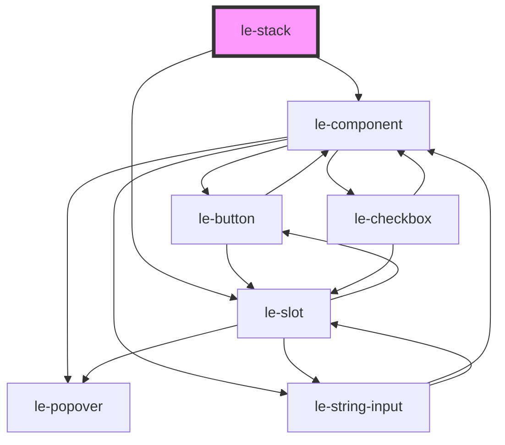

# le-stack

<!-- Auto Generated Below -->

## Overview

A flexible stack layout component using CSS flexbox.

`le-stack` arranges its children in a row (horizontal) or column (vertical)
with configurable spacing, alignment, and wrapping behavior. Perfect for
creating responsive layouts.

## Properties

| Property       | Attribute       | Description                                                            | Type                                                                                  | Default        |
| -------------- | --------------- | ---------------------------------------------------------------------- | ------------------------------------------------------------------------------------- | -------------- |
| `align`        | `align`         | Alignment of items on the cross axis                                   | `"baseline" \| "center" \| "end" \| "start" \| "stretch"`                             | `'stretch'`    |
| `alignContent` | `align-content` | Alignment of wrapped lines (only applies when wrap is true)            | `"center" \| "end" \| "space-around" \| "space-between" \| "start" \| "stretch"`      | `'stretch'`    |
| `direction`    | `direction`     | Direction of the stack layout                                          | `"horizontal" \| "vertical"`                                                          | `'horizontal'` |
| `fullHeight`   | `full-height`   | Whether the stack should take full height of its container             | `boolean`                                                                             | `false`        |
| `fullWidth`    | `full-width`    | Whether the stack should take full width of its container              | `boolean`                                                                             | `false`        |
| `gap`          | `gap`           | Gap between items (CSS value like '8px', '1rem', 'var(--le-space-md)') | `string`                                                                              | `undefined`    |
| `justify`      | `justify`       | Distribution of items on the main axis                                 | `"center" \| "end" \| "space-around" \| "space-between" \| "space-evenly" \| "start"` | `'start'`      |
| `maxItems`     | `max-items`     | Maximum number of items allowed in the stack (for CMS validation)      | `number`                                                                              | `undefined`    |
| `padding`      | `padding`       | Padding inside the stack container (CSS value)                         | `string`                                                                              | `undefined`    |
| `reverse`      | `reverse`       | Whether to reverse the order of items                                  | `boolean`                                                                             | `false`        |
| `wrap`         | `wrap`          | Whether items should wrap to multiple lines                            | `boolean`                                                                             | `false`        |

## Slots

| Slot | Description                                                  |
| ---- | ------------------------------------------------------------ |
|      | Default slot for stack items (le-box components recommended) |

## Shadow Parts

| Part      | Description |
| --------- | ----------- |
| `"stack"` |             |

## Dependencies

### Depends on

- [le-component](../le-component)
- [le-slot](../le-slot)

### Graph

----------------------------------------------

*Built with [StencilJS](https://stenciljs.com/)*
