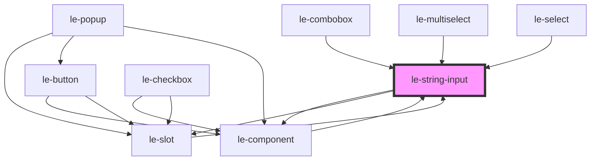

# le-string-input

<!-- Auto Generated Below -->

## Overview

A text input component with support for labels, descriptions, icons, and external IDs.

## Properties

| Property          | Attribute          | Description                                               | Type                                                | Default     |
| ----------------- | ------------------ | --------------------------------------------------------- | --------------------------------------------------- | ----------- |
| `disabled`        | `disabled`         | Whether the input is disabled                             | `boolean`                                           | `false`     |
| `externalId`      | `external-id`      | External ID for linking with external systems             | `string`                                            | `undefined` |
| `hideDescription` | `hide-description` | Hide description slot                                     | `boolean`                                           | `false`     |
| `iconEnd`         | `icon-end`         | Icon for the end icon                                     | `string`                                            | `undefined` |
| `iconStart`       | `icon-start`       | Icon for the start icon                                   | `string`                                            | `undefined` |
| `inputRef`        | --                 | Pass the ref of the input element to the parent component | `(el: HTMLInputElement) => void`                    | `undefined` |
| `label`           | `label`            | Label for the input                                       | `string`                                            | `undefined` |
| `mode`            | `mode`             | Mode of the popover should be 'default' for internal use  | `"admin" \| "default"`                              | `undefined` |
| `name`            | `name`             | The name of the input                                     | `string`                                            | `undefined` |
| `placeholder`     | `placeholder`      | Placeholder text                                          | `string`                                            | `undefined` |
| `readonly`        | `readonly`         | Whether the input is read-only                            | `boolean`                                           | `false`     |
| `type`            | `type`             | The type of the input (text, email, password, etc.)       | `"email" \| "password" \| "tel" \| "text" \| "url"` | `'text'`    |
| `value`           | `value`            | The value of the input                                    | `string`                                            | `undefined` |

## Events

| Event    | Description                                         | Type                                                                |
| -------- | --------------------------------------------------- | ------------------------------------------------------------------- |
| `change` | Emitted when the value changes (on blur or Enter)   | `CustomEvent<{ value: string; name: string; externalId: string; }>` |
| `input`  | Emitted when the input value changes (on keystroke) | `CustomEvent<{ value: string; name: string; externalId: string; }>` |

## Slots

| Slot            | Description                                           |
| --------------- | ----------------------------------------------------- |
|                 | The label text for the input                          |
| `"description"` | Additional description text displayed below the input |
| `"icon-end"`    | Icon to display at the end of the input               |
| `"icon-start"`  | Icon to display at the start of the input             |

## Shadow Parts

| Part          | Description |
| ------------- | ----------- |
| `"container"` |             |

## Dependencies

### Used by

 - [le-combobox](../le-combobox)
 - [le-component](../le-component)
 - [le-multiselect](../le-multiselect)
 - [le-select](../le-select)
 - [le-slot](../le-slot)

### Depends on

- [le-component](../le-component)
- [le-slot](../le-slot)

### Graph

----------------------------------------------

*Built with [StencilJS](https://stenciljs.com/)*
