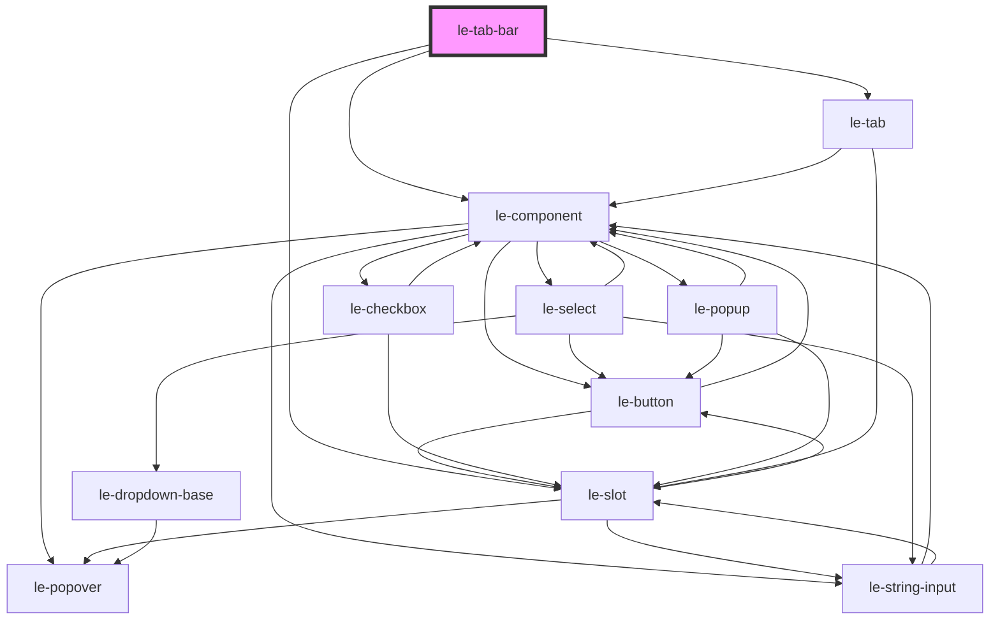

# le-tab-bar

<!-- Auto Generated Below -->

## Overview

A presentational tab bar component without panels.

Use this for navigation/routing scenarios where you manage the content
externally based on the selection events. For tabs with built-in panels,
use `le-tabs` instead.

## Properties

| Property     | Attribute     | Description                                          | Type                             | Default     |
| ------------ | ------------- | ---------------------------------------------------- | -------------------------------- | ----------- |
| `bordered`   | `bordered`    | Whether to show a border below the tab bar.          | `boolean`                        | `true`      |
| `fullWidth`  | `full-width`  | Whether tabs should stretch to fill available width. | `boolean`                        | `true`      |
| `position`   | `position`    | Position of the tab bar.                             | `"bottom" \| "top"`              | `'top'`     |
| `selected`   | `selected`    | The value of the currently selected tab.             | `number \| string`               | `undefined` |
| `showLabels` | `show-labels` | Whether to show labels in icon-only mode.            | `boolean`                        | `false`     |
| `size`       | `size`        | Size of the tabs.                                    | `"large" \| "medium" \| "small"` | `'medium'`  |
| `tabs`       | --            | Array of tab options defining the tabs to display.   | `LeOption[]`                     | `[]`        |

## Events

| Event         | Description                            | Type                                |
| ------------- | -------------------------------------- | ----------------------------------- |
| `leTabChange` | Emitted when the selected tab changes. | `CustomEvent<LeOptionSelectDetail>` |

## Shadow Parts

| Part        | Description |
| ----------- | ----------- |
| `"tablist"` |             |

## Dependencies

### Depends on

- [le-component](../le-component)
- [le-slot](../le-slot)
- [le-tab](../le-tab)

### Graph

----------------------------------------------

*Built with [StencilJS](https://stenciljs.com/)*
