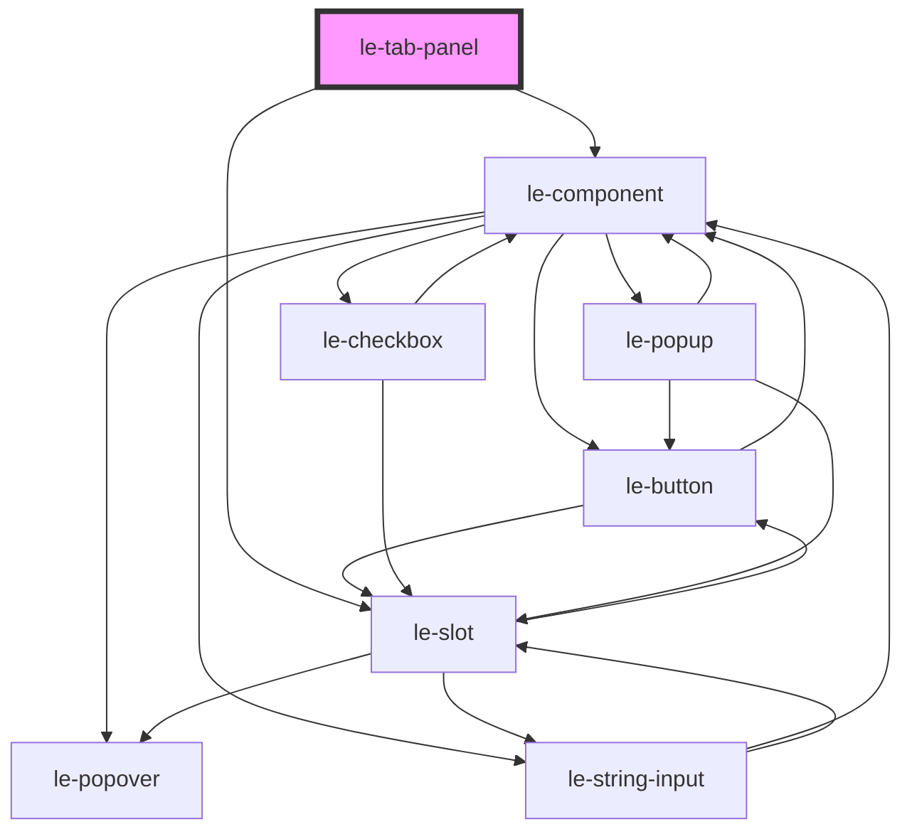

# le-tab-panel

<!-- Auto Generated Below -->

## Overview

A tab panel component used as a child of le-tabs.

Each le-tab-panel defines both the tab button label and the panel content.
The parent le-tabs component automatically reads these panels and creates
the tab interface.

## Properties

| Property             | Attribute    | Description                                                                                                                                                                                                       | Type      | Default     |
| -------------------- | ------------ | ----------------------------------------------------------------------------------------------------------------------------------------------------------------------------------------------------------------- | --------- | ----------- |
| `disabled`           | `disabled`   | Whether this tab is disabled.                                                                                                                                                                                     | `boolean` | `false`     |
| `iconEnd`            | `icon-end`   | Icon displayed at the end of the tab button.                                                                                                                                                                      | `string`  | `undefined` |
| `iconStart`          | `icon-start` | Icon displayed at the start of the tab button. Can be an emoji, URL, or icon class.                                                                                                                               | `string`  | `undefined` |
| `label` _(required)_ | `label`      | The label displayed in the tab button.                                                                                                                                                                            | `string`  | `undefined` |
| `lazy`               | `lazy`       | Whether to render the panel content only when active (lazy loading). When true, content is not rendered until the tab is first selected. When false (default), content is always in DOM but hidden when inactive. | `boolean` | `false`     |
| `value`              | `value`      | The value used to identify this tab. Defaults to the label if not provided.                                                                                                                                       | `string`  | `undefined` |

## Methods

### `getTabConfig() => Promise<{ label: string; value: string; iconStart?: string; iconEnd?: string; disabled: boolean; }>`

Get tab configuration for parent component

#### Returns

Type: `Promise<{ label: string; value: string; iconStart?: string; iconEnd?: string; disabled: boolean; }>`

### `getValue() => Promise<string>`

Get the effective value (value or label as fallback)

#### Returns

Type: `Promise<string>`

### `setActive(isActive: boolean) => Promise<void>`

Set the active state (called by parent le-tabs)

#### Parameters

| Name       | Type      | Description |
| ---------- | --------- | ----------- |
| `isActive` | `boolean` |             |

#### Returns

Type: `Promise<void>`

## Slots

| Slot | Description                    |
| ---- | ------------------------------ |
|      | Default slot for panel content |

## Dependencies

### Depends on

- [le-component](../le-component)
- [le-slot](../le-slot)

### Graph

----------------------------------------------

*Built with [StencilJS](https://stenciljs.com/)*
