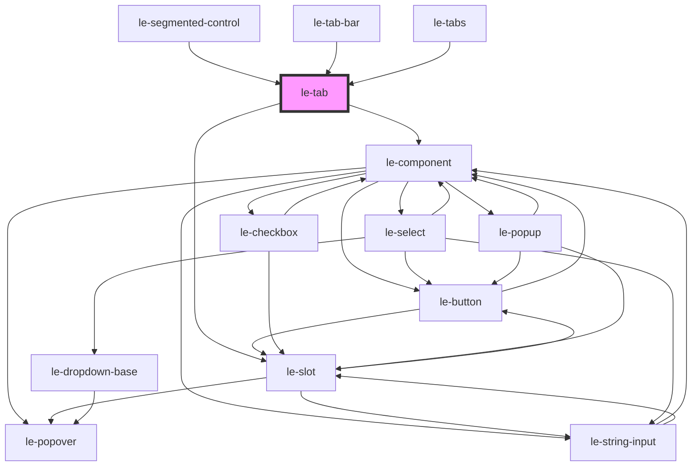

# le-button

A flexible button component with multiple variants, colors, sizes, and states.

## Features

- **Color themes**: Uses semantic colors from the theme (primary, secondary, success, warning, danger, info)
- **Variants**: solid, outlined, clear (ghost)
- **Sizes**: small, medium, large
- **States**: selected, disabled
- **Full width**: Expand to container width
- **Icon support**: icon-only mode, or icons before/after text
- **Link mode**: Can render as an anchor tag with `href`

## Usage

### Basic

```html
<le-button>Click me</le-button>
```

### Colors

```html
<le-button color="primary">Primary</le-button>
<le-button color="secondary">Secondary</le-button>
<le-button color="success">Success</le-button>
<le-button color="warning">Warning</le-button>
<le-button color="danger">Danger</le-button>
<le-button color="info">Info</le-button>
```

### Variants

```html
<le-button variant="solid">Solid</le-button>
<le-button variant="outlined">Outlined</le-button>
<le-button variant="clear">Clear</le-button>
```

### Sizes

```html
<le-button size="small">Small</le-button>
<le-button size="medium">Medium</le-button>
<le-button size="large">Large</le-button>
```

### With Icons

```html
<le-button>
  <svg slot="icon-start">...</svg>
  With Icon
</le-button>

<le-button icon-only>
  <svg slot="icon-start">...</svg>
</le-button>
```

### As Link

```html
<le-button href="https://example.com" target="_blank"> Visit Site </le-button>
```

### Full Width

```html
<le-button full-width>Full Width Button</le-button>
```

<!-- Auto Generated Below -->


## Overview

A flexible tab component with multiple variants and states.

## Properties

| Property    | Attribute    | Description                                                                                    | Type                                                              | Default        |
| ----------- | ------------ | ---------------------------------------------------------------------------------------------- | ----------------------------------------------------------------- | -------------- |
| `align`     | `align`      | Alignment of the tab label without the end icon                                                | `"center" \| "end" \| "space-between" \| "start"`                 | `'center'`     |
| `disabled`  | `disabled`   | Whether the tab is disabled                                                                    | `boolean`                                                         | `false`        |
| `focusable` | `focusable`  | Whether the tab can get focus needed for accessibility when used in custom tab implementations | `boolean`                                                         | `true`         |
| `fullWidth` | `full-width` | Whether the tab takes full width of its container                                              | `boolean`                                                         | `false`        |
| `href`      | `href`       | Optional href to make the tab act as a link                                                    | `string`                                                          | `undefined`    |
| `icon`      | `icon`       | Icon only tab image or emoji if this prop is set, the tab will render only the icon slot       | `Node \| string`                                                  | `undefined`    |
| `iconEnd`   | `icon-end`   | End icon image or emoji                                                                        | `Node \| string`                                                  | `undefined`    |
| `iconStart` | `icon-start` | Start icon image or emoji                                                                      | `Node \| string`                                                  | `undefined`    |
| `label`     | `label`      | Label if it is not provided via slot                                                           | `string`                                                          | `undefined`    |
| `mode`      | `mode`       | Mode of the popover should be 'default' for internal use                                       | `"admin" \| "default"`                                            | `undefined`    |
| `position`  | `position`   | Position of the tabs when used within a le-tabs component                                      | `"bottom" \| "end" \| "start" \| "top"`                           | `'top'`        |
| `selected`  | `selected`   | Whether the tab is in a selected/active state                                                  | `boolean`                                                         | `false`        |
| `showLabel` | `show-label` | Whether to show the label when in icon-only mode                                               | `boolean`                                                         | `false`        |
| `size`      | `size`       | Tab size                                                                                       | `"large" \| "medium" \| "small"`                                  | `'medium'`     |
| `target`    | `target`     | Link target when href is set                                                                   | `string`                                                          | `undefined`    |
| `value`     | `value`      | Value of the tab, defaults to label if not provided                                            | `string`                                                          | `undefined`    |
| `variant`   | `variant`    | Tab variant style                                                                              | `"enclosed" \| "icon-only" \| "pills" \| "solid" \| "underlined"` | `'underlined'` |


## Events

| Event   | Description                                                                                                               | Type                        |
| ------- | ------------------------------------------------------------------------------------------------------------------------- | --------------------------- |
| `click` | Emitted when the tab is clicked. This is a custom event that wraps the native click but ensures the target is the le-tab. | `CustomEvent<PointerEvent>` |


## Methods

### `getTabConfig() => Promise<{ label: string; value: string; icon: string | Node; iconStart?: string | Node; iconEnd?: string | Node; disabled: boolean; }>`

Get tab configuration for parent component

#### Returns

Type: `Promise<{ label: string; value: string; icon: string | Node; iconStart?: string | Node; iconEnd?: string | Node; disabled: boolean; }>`


## Slots

| Slot          | Description             |
| ------------- | ----------------------- |
|               | Tab text content        |
| `"icon-only"` | Icon for icon-only tabs |


## Shadow Parts

| Part           | Description |
| -------------- | ----------- |
| `"button"`     |             |
| `"content"`    |             |
| `"icon-end"`   |             |
| `"icon-start"` |             |


## Dependencies

### Used by

 - [le-segmented-control](../le-segmented-control)
 - [le-tab-bar](../le-tab-bar)
 - [le-tabs](../le-tabs)

### Depends on

- [le-component](../le-component)
- [le-slot](../le-slot)

### Graph


----------------------------------------------

*Built with [StencilJS](https://stenciljs.com/)*
