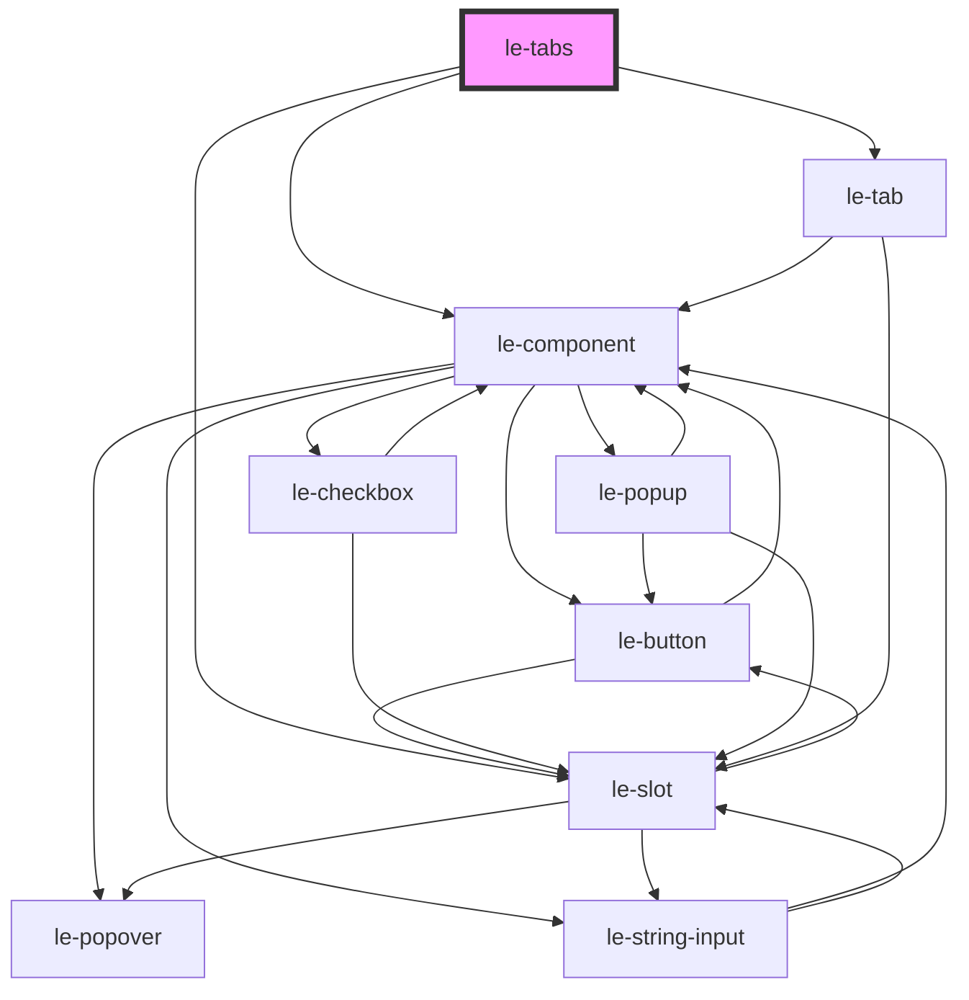

# le-tabs

<!-- Auto Generated Below -->

## Overview

A flexible tabs component for organizing content into tabbed panels.

Supports two modes:
1. **Declarative**: Use `<le-tab-panel>` children to define tabs and content
2. **Programmatic**: Use the `tabs` prop with named slots for content

Full keyboard navigation and ARIA support included.

## Properties

| Property      | Attribute     | Description                                                                                     | Type                                                              | Default        |
| ------------- | ------------- | ----------------------------------------------------------------------------------------------- | ----------------------------------------------------------------- | -------------- |
| `fullWidth`   | `full-width`  | Whether tabs should stretch to fill available width.                                            | `boolean`                                                         | `false`        |
| `orientation` | `orientation` | Orientation of the tabs.                                                                        | `"horizontal" \| "vertical"`                                      | `'horizontal'` |
| `overflow`    | `overflow`    | Scroll behavior for overflowing tabs.                                                           | `"auto" \| "hidden" \| "scroll" \| "visible"`                     | `'auto'`       |
| `position`    | `position`    | Position of the tabs relative to the panels.                                                    | `"end" \| "start"`                                                | `'start'`      |
| `selected`    | `selected`    | The value of the currently selected tab. If not provided, defaults to the first tab.            | `number \| string`                                                | `undefined`    |
| `size`        | `size`        | Size of the tabs.                                                                               | `"large" \| "medium" \| "small"`                                  | `'medium'`     |
| `tabs`        | --            | Array of tab options (programmatic mode). If le-tab-panel children exist, they take precedence. | `LeOption[]`                                                      | `[]`           |
| `variant`     | `variant`     | Tab variant style.                                                                              | `"enclosed" \| "icon-only" \| "pills" \| "solid" \| "underlined"` | `'underlined'` |
| `wrap`        | `wrap`        | Wrap the tabs if they exceed container width.                                                   | `boolean`                                                         | `false`        |

## Events

| Event         | Description                            | Type                                |
| ------------- | -------------------------------------- | ----------------------------------- |
| `leTabChange` | Emitted when the selected tab changes. | `CustomEvent<LeOptionSelectDetail>` |

## Slots

| Slot              | Description                                               |
| ----------------- | --------------------------------------------------------- |
|                   | Default slot for le-tab-panel children (declarative mode) |
| `"panel-{value}"` | Named slots for panel content (programmatic mode)         |

## Shadow Parts

| Part        | Description |
| ----------- | ----------- |
| `"panel"`   |             |
| `"panels"`  |             |
| `"tablist"` |             |

## Dependencies

### Depends on

- [le-component](../le-component)
- [le-tab](../le-tab)
- [le-slot](../le-slot)

### Graph

----------------------------------------------

*Built with [StencilJS](https://stenciljs.com/)*
