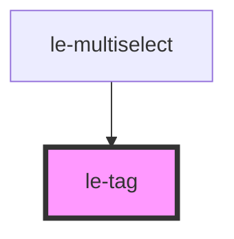

# le-tag

<!-- Auto Generated Below -->

## Overview

A tag/chip component for displaying labels with optional dismiss functionality.

## Properties

| Property      | Attribute     | Description                                                           | Type                                                           | Default     |
| ------------- | ------------- | --------------------------------------------------------------------- | -------------------------------------------------------------- | ----------- |
| `disabled`    | `disabled`    | Whether the tag is disabled.                                          | `boolean`                                                      | `false`     |
| `dismissible` | `dismissible` | Whether the tag can be dismissed (shows close button).                | `boolean`                                                      | `false`     |
| `icon`        | `icon`        | Icon to display before the label. Can be an emoji, URL, or icon name. | `string`                                                       | `undefined` |
| `label`       | `label`       | The text label to display in the tag.                                 | `string`                                                       | `undefined` |
| `size`        | `size`        | The size of the tag.                                                  | `"large" \| "medium" \| "small"`                               | `'medium'`  |
| `variant`     | `variant`     | The visual variant of the tag.                                        | `"danger" \| "default" \| "primary" \| "success" \| "warning"` | `'default'` |

## Events

| Event       | Description                                 | Type                |
| ----------- | ------------------------------------------- | ------------------- |
| `leDismiss` | Emitted when the dismiss button is clicked. | `CustomEvent<void>` |

## Slots

| Slot | Description                                            |
| ---- | ------------------------------------------------------ |
|      | Default slot for custom content (overrides label prop) |

## Dependencies

### Used by

 - [le-multiselect](../le-multiselect)

### Graph

----------------------------------------------

*Built with [StencilJS](https://stenciljs.com/)*
