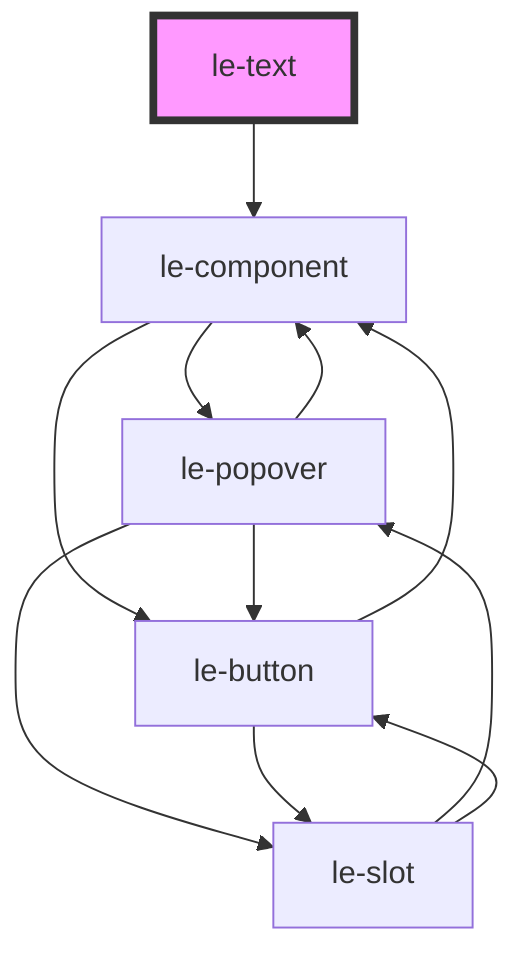

# le-text

<!-- Auto Generated Below -->

## Overview

A text component with rich text editing capabilities in admin mode.

`le-text` renders semantic text elements (headings, paragraphs, code, quotes)
and provides a Notion-like rich text editor in admin mode with formatting
toolbar for bold, italic, links, and paragraph type selection.

## Properties

| Property   | Attribute   | Description                                                        | Type                                                                                             | Default     |
| ---------- | ----------- | ------------------------------------------------------------------ | ------------------------------------------------------------------------------------------------ | ----------- |
| `align`    | `align`     | Text alignment                                                     | `"center" \| "justify" \| "left" \| "right"`                                                     | `'left'`    |
| `color`    | `color`     | Text color (CSS value or theme token)                              | `string`                                                                                         | `undefined` |
| `maxLines` | `max-lines` | Maximum number of lines before truncating (requires truncate=true) | `number`                                                                                         | `undefined` |
| `truncate` | `truncate`  | Whether the text should truncate with ellipsis                     | `boolean`                                                                                        | `false`     |
| `variant`  | `variant`   | The semantic variant/type of text element                          | `"code" \| "h1" \| "h2" \| "h3" \| "h4" \| "h5" \| "h6" \| "label" \| "p" \| "quote" \| "small"` | `'p'`       |

## Slots

| Slot | Description                   |
| ---- | ----------------------------- |
|      | Default slot for text content |

## Shadow Parts

| Part     | Description |
| -------- | ----------- |
| `"text"` |             |

## Dependencies

### Depends on

- [le-component](../le-component)

### Graph

----------------------------------------------

*Built with [StencilJS](https://stenciljs.com/)*
