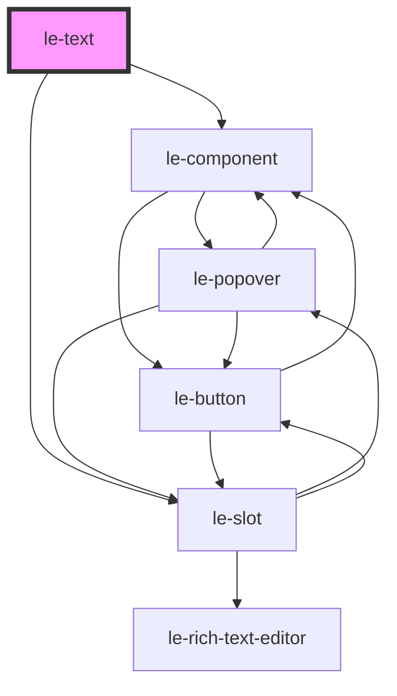

# le-text

<!-- Auto Generated Below -->

## Overview

A minimal text container component with rich text editing in admin mode.

`le-text` is a transparent wrapper that passes through its content without
applying any styles. All styling comes from the theme and CSS classes on
the element itself.

In admin mode, it provides a block-level rich text editor with:
- Notion-style "/" command for block type selection (p, h1-h6, blockquote, code)
- Enter creates new paragraphs
- Inline formatting (bold, italic, underline, strikethrough, links)

## Properties

| Property        | Attribute        | Description                                                                                                                                                                                                                                             | Type                                | Default     |
| --------------- | ---------------- | ------------------------------------------------------------------------------------------------------------------------------------------------------------------------------------------------------------------------------------------------------- | ----------------------------------- | ----------- |
| `editorVariant` | `editor-variant` | Rich text editor variant (only applies in admin mode) - `minimal`: No toolbar, just contenteditable with / commands - `standard`: Basic formatting (bold, italic, underline) + / commands - `full`: All formatting options including links + / commands | `"full" \| "minimal" \| "standard"` | `'full'`    |
| `placeholder`   | `placeholder`    | Placeholder text shown when the editor is empty (admin mode only)                                                                                                                                                                                       | `string`                            | `undefined` |

## Slots

| Slot | Description                                                                   |
| ---- | ----------------------------------------------------------------------------- |
|      | Default slot for text content (can be text nodes, paragraphs, headings, etc.) |

## Dependencies

### Depends on

- [le-component](../le-component)
- [le-slot](../le-slot)

### Graph

----------------------------------------------

*Built with [StencilJS](https://stenciljs.com/)*
