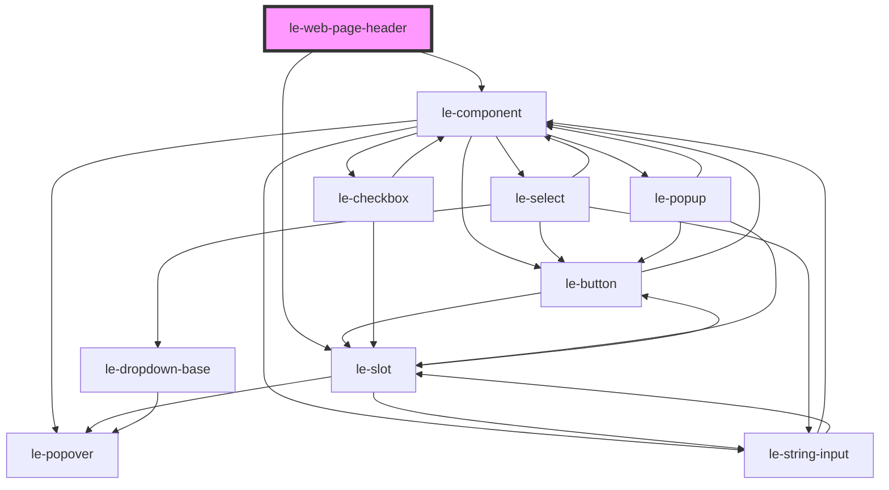

# le-web-page-header

<!-- Auto Generated Below -->

## Overview

A functional page header with scroll-aware behaviors.

Features:
- Static or fixed (fixed keeps layout space via a placeholder)
- Optional shrink-on-scroll styling hook
- Optional reveal-on-scroll-up (hide on down, show on up)
- Optional title handoff via event + scroll position

Slots:
- `start`: left side (logo/back button)
- `title`: centered/primary title content
- `end`: right side actions
- default: extra content row (e.g., tabs/search) rendered below main row

Events listened:
- `leWebPageTitleChange`: set a compact title to show when page title scrolled away
- `leWebPageTitleVisibility`: alternatively drive title visibility explicitly

## Properties

| Property          | Attribute          | Description                                                                                                                                        | Type                  | Default    |
| ----------------- | ------------------ | -------------------------------------------------------------------------------------------------------------------------------------------------- | --------------------- | ---------- |
| `mode`            | `mode`             | Layout behavior. `fixed` uses a placeholder to avoid overlap.                                                                                      | `"fixed" \| "static"` | `'static'` |
| `reveal`          | `reveal`           | Reveal behavior: hide on scroll down, show on scroll up.                                                                                           | `"none" \| "reveal"`  | `'none'`   |
| `revealThreshold` | `reveal-threshold` | Minimum delta (px) to consider direction changes (reduces jitter).                                                                                 | `number`              | `8`        |
| `shrink`          | `shrink`           | Shrink styling hook when scrolling down beyond `shrinkOffset`.                                                                                     | `"none" \| "shrink"`  | `'none'`   |
| `shrinkOffset`    | `shrink-offset`    | Y offset (px) after which `shrunk` becomes true.                                                                                                   | `number`              | `24`       |
| `smartTitle`      | `smart-title`      | If true, show a compact title when the page title is not visible. Title content is driven by `leWebPageTitleChange` or `leWebPageTitleVisibility`. | `boolean`             | `false`    |

## Events

| Event                  | Description                                 | Type                                                                                         |
| ---------------------- | ------------------------------------------- | -------------------------------------------------------------------------------------------- |
| `leWebPageHeaderState` | Emits whenever scroll-driven state changes. | `CustomEvent<{ y: number; direction: "up" \| "down"; revealed: boolean; shrunk: boolean; }>` |

## Slots

| Slot      | Description                    |
| --------- | ------------------------------ |
|           | Optional secondary row content |
| `"end"`   | End area content               |
| `"start"` | Start area content             |
| `"title"` | Title content                  |

## Shadow Parts

| Part            | Description |
| --------------- | ----------- |
| `"end"`         |             |
| `"header"`      |             |
| `"inner"`       |             |
| `"placeholder"` |             |
| `"row"`         |             |
| `"secondary"`   |             |
| `"start"`       |             |
| `"title"`       |             |

## Dependencies

### Depends on

- [le-component](../le-component)
- [le-slot](../le-slot)

### Graph

----------------------------------------------

*Built with [StencilJS](https://stenciljs.com/)*
